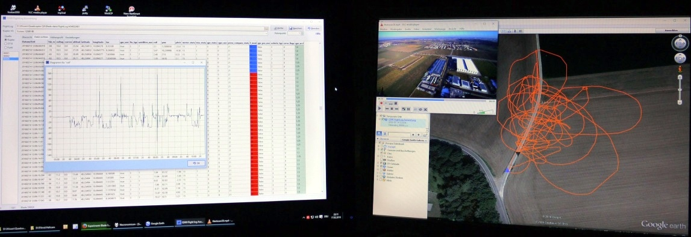

# Q500log2kml
This application was made to display and analyze FlightLog data (including Telemetry) from Yuneec copter Q500, H520, H920, Typhoon H, Typhoon H Plus, H3, Breeze, Mantis Q, but also Blade Chroma or Blade 350QX controlled by ST10).
Additionally the CSV files from Tom's flight data recorder for Hubsan can be displayed and analyzed.

The FlightLog data are available on RC-Controller or smart device used to control the aircraft. The FlightLog can be downloaded via micro USB connector.
For a proper analysis the whole FlightLog directory with all sub directories needs to be copied unchanged to your PC.
Only directories will be opened by the application, not files. The only exception are sensor files from Typhoon H Plus which needs to be opened as single file.

Features (short description):
-----------------------------

Archive: Rename the FlightLog directory by using a time stamp to avoid overwriting older data. This should be the first action if you move the FlightLog data from ST10 to your PC.

Convert: Convert telemetry data from copter to KML- or KMZ-files (flight path for Google Earth), GPX for other map services, for import to DashWare in order to get telemetry data in videos, as CSV file for RaceRender or as CCC waypoint file.

Overview: Some important information for the flights in a table form (ceiling, max. air speed, max. distance, warnings, etc).

Flight record: Scan a whole directory for telemetry files and generate a flight record.

Search problem cases: Scan a whole directory with FlightLogs for predefined known problem cases (like crashes or compass warnings). This is not available for Yuneec Breeze.

Display files: Browse raw data of Telemetry, Remote, RemoteGPS or Sensor files. Use this for deeper analysis. Sensor or TLOG files from PX4 controllers will be partially analyzed. There is only a basic support.

Search: Search in a column of file display table. Depending on values in the columns, part of the search string or whole search string will be used to find something.

Elevation histogram: Graphic elevation histogram and voltage curve. Cursor for analysis functionality.

Quick analysis: Three different and select-able Histograms on the same tab sheet for quick overview and compare. Some useful profiles are available to speed-up your checks.

Cut files: This function provides the possibility to cut out parts of the FlightLog and save it in a new FlightLog file set.

Analysis: Analyze a predefined data area to see i.e. average speed, climb rate…

Settings: Three tab sheets for commission settings of the application.

AppLog: Listing of actions, messages and errors from the application. For sensor files from the Typhoon H Plus, H520 or Mantis Q, text messages (MAV link "statustext") and some other data from different messages will be listed too.

Hex dump: Dump an unknown file as hexadecimal for analysis. Result can be saved as text.

MacOS version compiled and only tested with at MacOS 10.14 (Mojave).

---------------------------------------

**For news and updates see "history.txt"**
